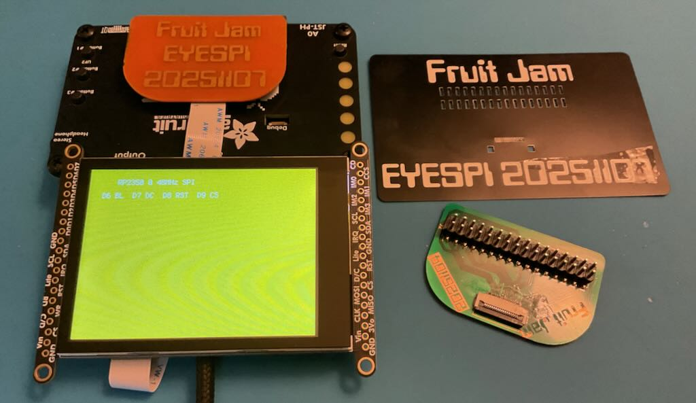
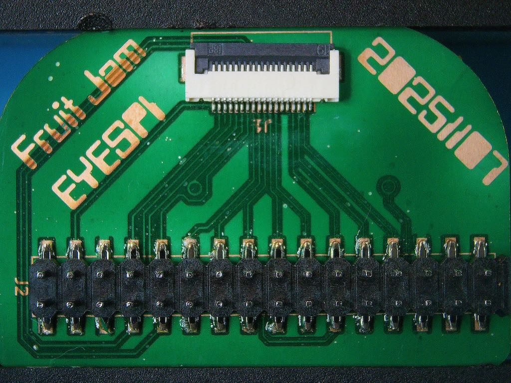
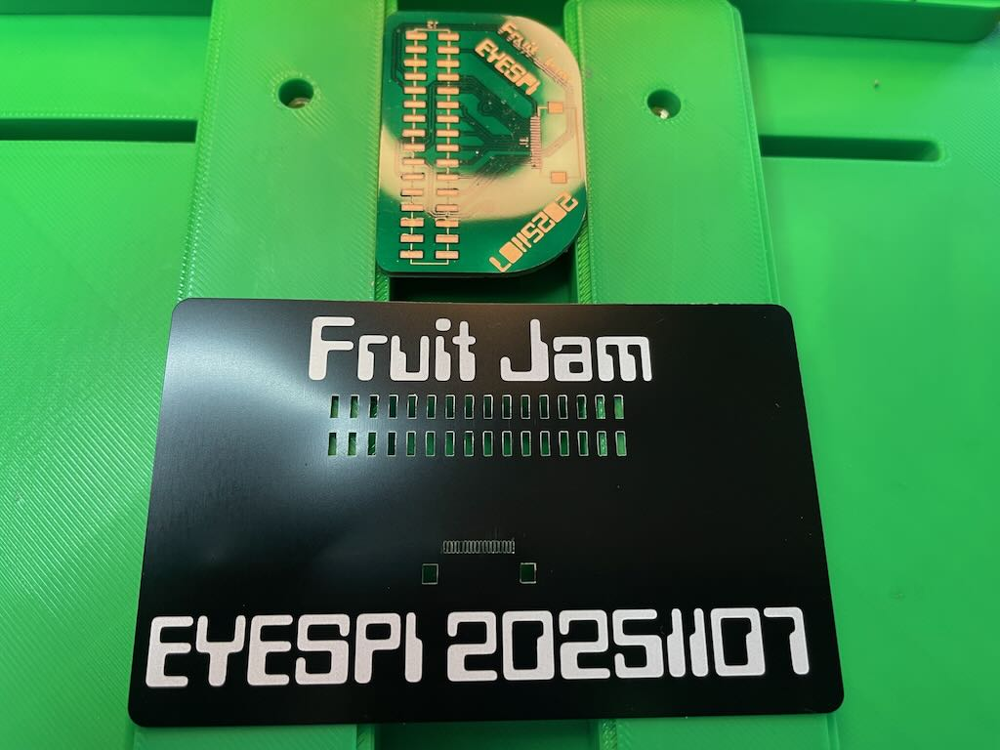

# Fruit Jam → EyeSPI Display Adapter


*Single-sided breakout board CNC-milled, fiber-laser etched, and resin-coated.*

---

## Overview

This project is a **compact breakout PCB** that connects the **16-pin Adafruit Fruit Jam header** to an **18-pin EyeSPI FPC** connector for driving TFT displays 

It allows the **Fruit Jam** to output to Adafruit EyeSPI displays, enabling small embedded builds like:

- 🎧 **MP3 or media players**
- 🕹️ **Mini gaming consoles**
- 💻 **Pocket computers**
- 🔧 **Control panels and dashboards**
- 📟 **Status monitors**
- 🧩 **Rapid prototyping setups**

---



## Features

- Plug-and-play with **Adafruit EyeSPI TFT displays**
- Fully compatible with **CircuitPython 10**
- Fabricated as a **single-sided PCB** using **CNC + fiber laser**
- Protected with a **UV resin coat** for strength and finish
- Low Profile and easy SMT stencil assembly

---

## 📁 Repository Structure

| Folder | Description |
|:-------|:-------------|
| `/fj-eyespi/` | KiCad schematic and PCB layout files |
| `/fj-eyespi/fj-eyespi.step` | 3D STEP and render files for case design or visualization |
| `/images/` | Build photos, renders, and setup examples |

---



## 🧩 Hardware Design

- **Input:** 16-pin Fruit Jam display header  
- **Output:** 18-pin EyeSPI FFC (0.5 mm pitch)  
- **Board Type:** Single-sided PCB  
- **Fabrication:** CNC milled + laser etched traces + resin coat  
- **Connector Orientation:** FFC faces upward (standard EyeSPI alignment)

**Example Configuration:**

### 🧩 Pin Mapping — Fruit Jam 2×16 Header (J2) → EyeSPI 18-Pin Socket (J1)

| Function | Fruit Jam Pin (J2) | EyeSPI Pin (J1) | Notes |
|:----------|:------------------:|:----------------:|:------|
| 5 V | 1 / 2 / 31 / 32 | — | 5 V rail (not used by EyeSPI) |
| 3.3 V (VCC) | 3 / 30 | 18 (VCC) | Main display power |
| GND | 5 / 6 / 28 / 29 | 16 (GND) | Ground return |
| Backlight EN (lite) | 8 | 17 (lite) | Controls display backlight |
| SCL / SPI CLK | 7 / 21 | 15 (sck) | SPI clock signal |
| SDA / SPI MOSI | 9 / 17 | 14 (mosi) | SPI data (MCU → display) |
| MISO | 19 | 13 (miso) | SPI data (display → MCU) |
| DC (Display Command) | 10 | 12 (dc) | Command / data select |
| RESET | 12 / 25 | 11 (rst) | Hardware reset |
| TCS (Display CS) | 14 | 10 (tcs) | Display chip-select |
| SDCS (SD Card CS) | 16 | 9 (sdcs) | SD card chip-select |
| MCS | 18 | 8 (mcs) | Memory chip-select (optional) |
| TSCS (Touch CS) | 20 | 7 (tscs) | Touch controller chip-select |
| SCL /I²C | 7 | 6 (scl) | For touch controller (I²C mode) |
| SDA /I²C | 9 | 5 (sda) | For touch controller (I²C mode) |
| INT | 22 | 4 (int) | Touch interrupt signal |
| BUSY | 24 | 3 (busy) | ePaper / Touch busy signal |
| GPIO1 | 26 | 2 (gpio1) | General purpose I/O |
| GPIO2 | 27 | 1 (gpio2) | General purpose I/O |

---

### 📘 Notes

- Logic-level operation is **3.3 V only** — no level shifting required.  
- Supports SPI or I²C EyeSPI displays (e.g. ST7789, ILI9341, GC9A01, and ePaper).  
- Unused pins can be repurposed for GPIO or future display functions.  
- Compatible with **CircuitPython `displayio`** and Adafruit Display libraries.  

*(Add your final verified pin mapping table and reference diagram here.)*

---

## 🧪 Testing & Compatibility

The adapter has been validated with the following setup:

- **CircuitPython 10.x**  
- **Adafruit Fruit Jam** (RP2350-based)  
- **Displays:**  
  - TL034WVS05-B1477A 480×480 TFT  
  - 1.9" 240×320 TFT (EyeSPI)  
- **Libraries:** `displayio`, `adafruit_st7789`, `adafruit_rgb_display`  

**Example Test Code:**

```python
import board, displayio
from adafruit_st7789 import ST7789

spi = board.SPI()
tft_cs = board.D9
tft_dc = board.D10
display_bus = displayio.FourWire(spi, command=tft_dc, chip_select=tft_cs)
display = ST7789(display_bus, width=240, height=320, rotation=180)

